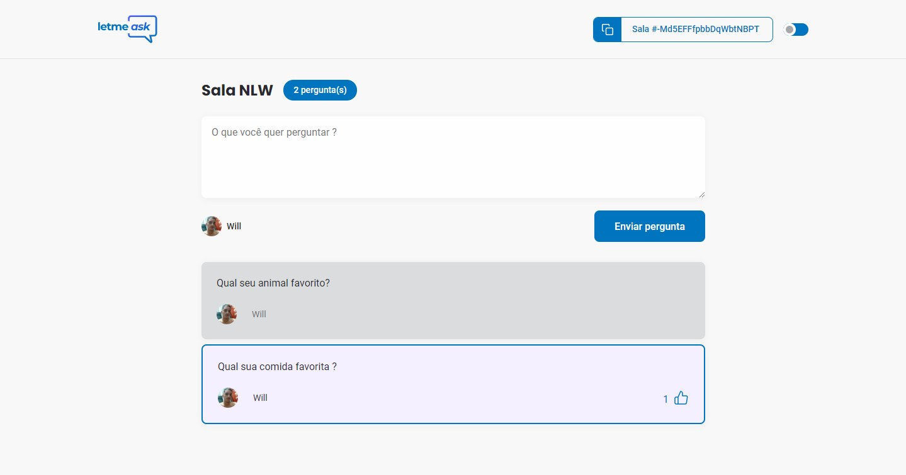
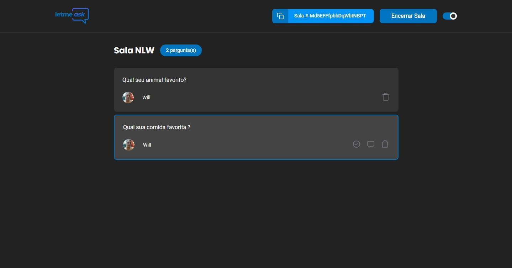

<p align="center">
 
</p>

<p align="center">

</p>

### Modo Usuário com tema padrão
<div align="center">
  
</div>

### Modo Admin com tema Dark
<div align="center">
  
</div>

<div align="center">
  <a href="https://letmeask-36226.web.app/">Demonstração do App</a>
</div>

---
## 🔧 Ferramentas e Tecnologias
Esse projeto foi desenvolvido com as seguintes tecnologias:
- [React](https://reactjs.org)
- [Firebase](https://firebase.google.com/)
- [TypeScript](https://www.typescriptlang.org/)

---

## 💡 Sobre o Projeto

O projeto foi desenvolvido no evento Next Level Week #Together pela [Rocketseat](https://rocketseat.com.br/) 🚀&nbsp;💜
O LetmeAsk é um app de Q&A, para organizar perguntas para responder em lives etc.
___

## 🔖 Layout
Você pode visualiza o layout do projeto pelo Figma.
- [Layout no Figma](https://www.figma.com/file/u0BQK8rCf2KgzcukdRRCWh/Letmeask/duplicate) 


---
## 💻 Instruções para visualizar o projeto
### Requerimentos

- [Node.js](https://nodejs.org/en/download/)


```bash
    # Clone este repositório
    $ git clone https://github.com/willnogueyra/letmeask

    # Entre na pasta
    $ cd letmeask

    #instale as dependências necessárias com:
    npm i ou yarn

    #agora start o projeto
    npm start ou yarn start

    # OBS: O app vai inicializar em <http://localhost:3000>
```
---
## 📚 Atividades realizadas

1º dia
- [x] Configuração de ambiente de desenvolvimento
- [x] Configurações iniciais do Firebase

2º dia
- [x] Autenticação de usuarios
- [x] Criação de sala
- [x] Roteamento e navegação

3º dia
- [x] Criação de sala
- [x] Controller de usuarios
- [x] Respondendo e criando perguntas
- [x] Crindo hook useRom

4º dia
- [x] Entrutura de perguntas
- [x] Hook useRoom
- [x] Funcionalidade de like
- [x] Controle de sala (admin)
- [x] Controle de perguntas

5º dia
- [x] Destaque de perguntas respondidas
- [x] Marca pergunta respondida
- [x] Hospedando projeto

Bônus
- [x] Tema dark
- [ ] Responsividade
- [ ] Versão PWA
- [ ] Outro banco de dados

---

Feito por 💜&nbsp; William Nogueira 👋 &nbsp;[linkedin](https://www.linkedin.com/in/willnogueyra/)